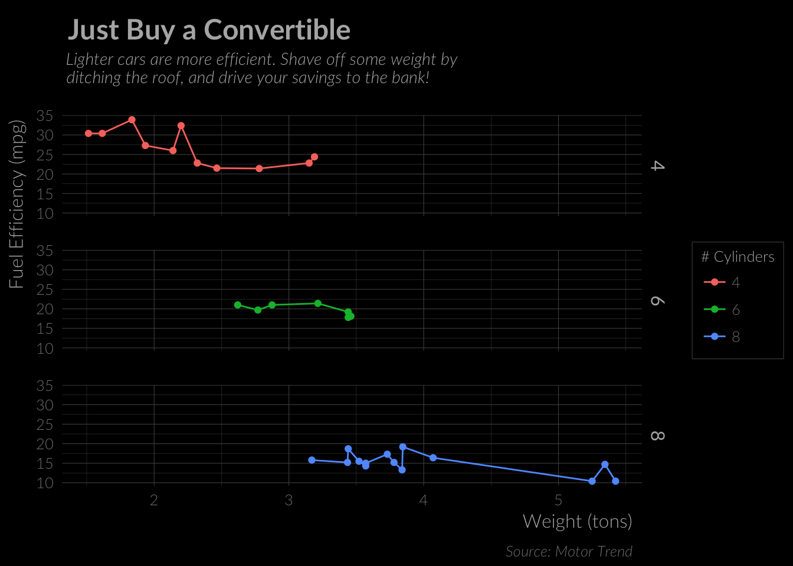

<!-- README.md is generated from README.Rmd. Please edit that file -->
lato
====

[](http://www.repostatus.org/#wip)
[](https://opensource.org/licenses/MIT)

**This package is in early development. It probably will not work well
for you.**

It will also be re-named.

Installation
------------

This package is not ready for [CRAN](http://cran.r-project.org/) just
yet, but you can use
[devtools](http://cran.r-project.org/web/packages/devtools/index.html)
to be wild and install install the latest and greatest development
version. To do so:

``` r
if(!require("devtools")) install.packages("devtools")
devtools::install_github("briandconnelly/lato") 
```

Example
-------

``` r
library(ggplot2)
library(lato)

p1 <- ggplot(mtcars, aes(wt, mpg, color = as.factor(cyl) )) +
    facet_grid(cyl ~ .) +
    geom_line() +
    geom_point() +
    scale_color_hue(name = "# Cylinders") +
    labs(
        x = "Weight (tons)",
        y = "Fuel Efficiency (mpg)",
        title = "Just Buy a Convertible",
        subtitle = "Lighter cars are more efficient. Shave off some weight by\nditching the roof, and drive your savings to the bank!",
        caption = "Source: Motor Trend"
    ) +
    theme_lato()

p1
```


### Dark Mode

``` r
p1 + theme_lato_dark()
```



Contributer Code of Conduct
---------------------------

This project is released with a [Contributor Code of
Conduct](CONDUCT.md). By participating in this project you agree to
abide by its terms.
