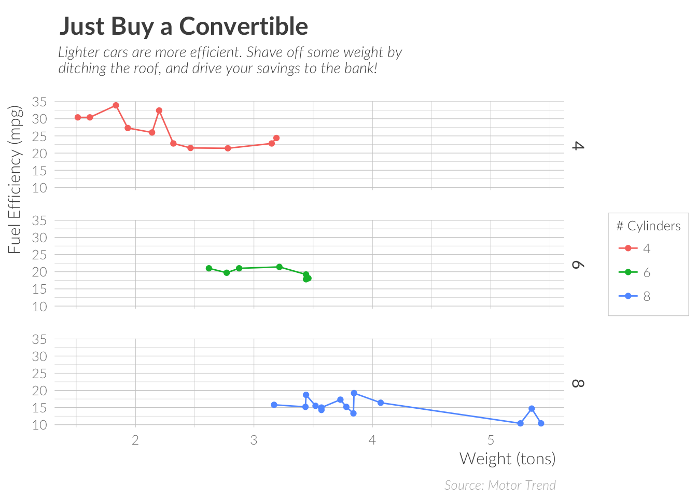

<!-- README.md is generated from README.Rmd. Please edit that file -->
lato
====

**This package is in early development. It probably will not work well
for you.**

Example
-------

``` r
library(ggplot2)
library(lato)

ggplot(mtcars, aes(wt, mpg, color = as.factor(cyl) )) +
    facet_grid(cyl ~ .) +
    geom_line() +
    geom_point() +
    scale_color_hue(name = "# Cylinders") +
    labs(
        x = "Weight (tons)",
        y = "Fuel Efficiency (mpg)",
        title = "Just Buy a Convertible",
        subtitle = "Lighter cars are more efficient. Shave off some weight by\nditching the roof, and drive your savings to the bank!",
        caption = "Source: Motor Trend"
    ) +
    theme_lato()
```



Contributer Code of Conduct
---------------------------

This project is released with a [Contributor Code of
Conduct](CONDUCT.md). By participating in this project you agree to
abide by its terms.
